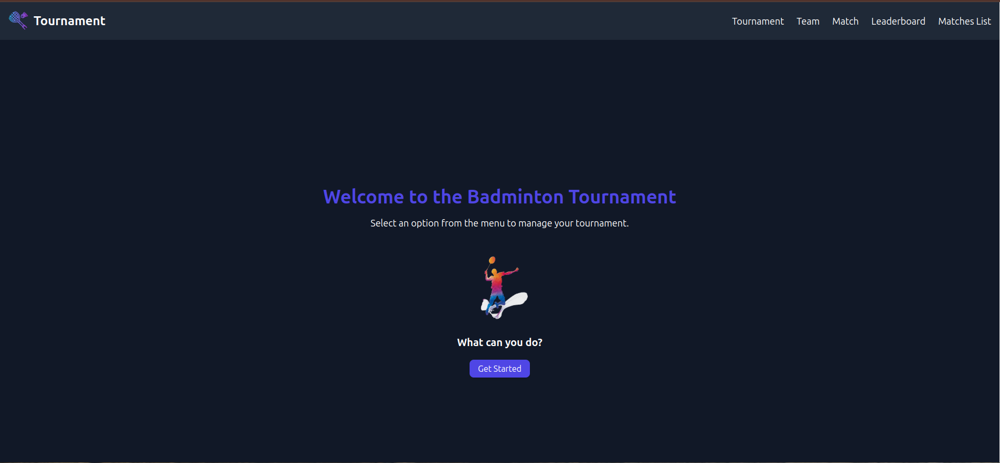
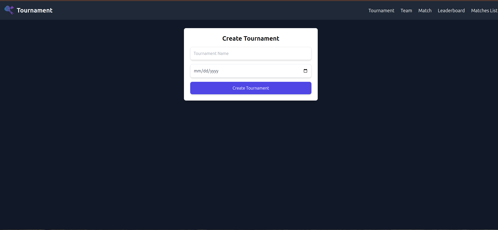

# Badminton Tournament App

## Overview
The Badminton Tournament App is a mobile-responsive web application designed for managing and tracking badminton tournaments. Built using **React.js**, **Zustand**, and **Tailwind CSS**, the app provides an intuitive interface for creating tournaments, adding teams, updating match scores, and displaying a leaderboard.

## Live Demo

You can access the live application here: [](https://badminton-tournament.pages.dev/)

---




---

## Features

### 1. Tournament Management
- Create new tournaments.
- Add and organize teams within a tournament.

### 2. Team Management
- Add teams participating in the tournament.
- Assign team names and manage their details.

### 3. Match Scoring
- Add match scores for games between teams.
- Real-time updates to the leaderboard based on match results.

### 4. Leaderboard
- Displays team rankings based on their scores.
- Mobile-friendly and visually appealing layout.

---

## Tech Stack

- **React.js**: For building a dynamic and responsive user interface.
- **Zustand**: Lightweight state management for efficient handling of application state.
- **Tailwind CSS**: For styling the application with customizable utility-first CSS classes.

---

## Installation

1. Clone the repository:
   ```bash
   git clone git@github.com:Rushan-Chithranga/badminton-tournament-app.git
   ```

2. Navigate to the project directory:
   ```bash
   cd badminton-tournament-app
   ```

3. Install dependencies:
   ```bash
   npm install
   ```

4. Start the development server:
   ```bash
   npm run dev
   ```

5. Open the app in your browser at `http://localhost:5173`.

---

## Folder Structure

```
.
├── src
│   ├── components          # Reusable React components
│   ├── pages               # Pages like Tournaments, Teams, 
│   ├── store               # Zustand store for state management
│   ├── styles              # Tailwind CSS configurations
│   └── utils               # Utility functions
├── public                  # Static assets
├── index.html              # HTML entry point
└── package.json            # Project dependencies and scripts
```

---

## Usage

### Creating a Tournament
1. Navigate to the **Tournaments** page.
2. Click on `Create Tournament`.
3. Enter the tournament name and details.
4. Save the tournament.

### Adding Teams
1. Navigate to the **Teams** page.
2. Click on `Add Team`.
3. Provide the team name and other details.
4. Save the team.

### Updating Match Scores
1. Go to the **Matches** page.
2. Select a match and input scores for both teams.
3. Save the scores to update the leaderboard.

### Viewing the Leaderboard
1. Access the **Leaderboard** page to view the current rankings.
2. Rankings are automatically updated based on match results.

---

## Customization

- Modify **Tailwind CSS** styles in `tailwind.config.js` to adjust the app's appearance.
- Extend application features by adding new components or modifying existing ones.

